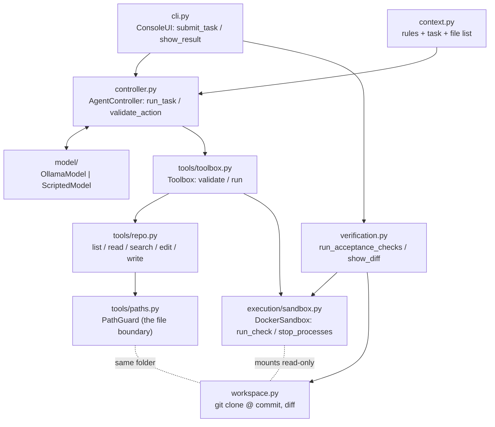
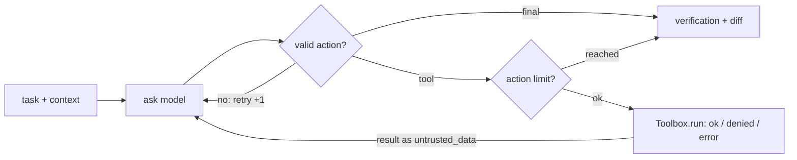

# Stage 1: a small coding harness

A command-line application that hands a bug-fix request to a local LLM, lets it
read and edit a **disposable copy** of a repository through **checked tools**,
lets it run tests in a **locked-down Docker container**, and then **verifies the
result itself**: hidden acceptance test + existing tests + scope check + diff.

Built from scratch in Python on top of the week-1 lab code, with no agent
framework. Runtime dependencies: the standard library plus `python-dotenv` and
`pyflakes` (for lint-on-edit).

## Run it

Requirements: [uv](https://docs.astral.sh/uv/), Git, Docker Desktop (running),
Ollama with a model pulled (`ollama pull qwen2.5-coder:7b`).

```bash
uv sync                                                     # install dependencies
uv run semProject/main.py baseline --task semProject/tasks/cosmic-batchref
uv run semProject/main.py run --task semProject/tasks/cosmic-batchref
uv run pytest                                               # core tests (no Docker/model needed)
uv run pytest -m docker                                     # container + end-to-end tests
```

| Command | What it does |
|---|---|
| `baseline` | Fresh workspace, no model, only verification. The acceptance check must **fail** here. |
| `baseline --patch <file>.patch` | Same, after applying a patch. With `reference_fix.patch` everything must **pass**. |
| `run` | Fresh workspace, model works on the task, then verification. Exit code 0 only if verified. |
| `run --script <file>.json` | Same, but replies come from a script instead of a model (dry run / demo). |

Options: `--model`, `--max-actions`, `--workdir`. Settings can also go in `.env`
(see `.env.example`). The first run builds the sandbox image (about 30 s). Every
run writes a JSONL log to `semProject/runs/`.

## Architecture



The loop (`controller.py`), which is the handout's Figure 3:



The loop always ends: every turn either finishes, uses up one **action**, or
uses up one **retry**, and both have hard limits.

| Handout part | Where | Carried over from the lab |
|---|---|---|
| Interface | `cli.py` | `cli.py` (Logger, event printing) |
| Controller | `controller.py`, `context.py` | `agent.py` (`run_agent`, `parse_action`) |
| Model client | `model/ollama.py`, `model/scripted.py` | `model.py` |
| Repository tools | `tools/repo.py`, `tools/paths.py`, `tools/toolbox.py`, `tools/lint.py` | `runtime.py` (tools, `resolve`, dispatch) |
| Execution | `execution/process.py`, `execution/sandbox.py` | `runtime.py` (`run_command`, `kill_tree`) |
| Limits | `limits.py` | constants from `runtime.py` |
| Verification | `verification.py`, `workspace.py` | new |

Changes from the lab: the free `bash` tool and its approval prompt are gone. The
model can only run **named checks** from the task file (`run_check("tests")`),
and those run in Docker instead of on the host. Protected files became an
**allow-list** of writable folders. `fetch_url` was dropped.

## Containment

| Risk | What stops it |
|---|---|
| Model reads/writes outside the repo | `PathGuard`: relative paths only; no `..`; no hidden files (`.git`, `.env`); symlinks resolved; writes only inside `writable` |
| Model runs arbitrary commands | It can't: `run_check` only accepts check *names* from `task.toml` |
| Repository code (tests) misbehaves | Docker: `--network none`, code mounted **read-only**, read-only root FS, non-root user, `--cap-drop ALL`, `no-new-privileges`, memory/CPU/process caps, no host env vars |
| Stuck or flooding command | Timeout + output cap; the container is removed (`docker rm -f`), the client process tree killed; all containers of a run carry a label and are removed at the end |
| Original repo / pushing | Every run clones a fresh copy at a pinned commit; the `origin` remote is deleted |
| Model claims success | Verification reruns everything itself; failed or unavailable checks stay visible |
| Prompt injection via file contents | Tool results are labeled `untrusted_data`, but the hard guarantees above don't depend on the model obeying |

## The task (`tasks/cosmic-batchref/`)

- **Target:** [cosmicpython/code](https://github.com/cosmicpython/code) at commit
  `14c84797ffa77255d53cf1a02fe6aafda2b68aeb` (domain model, service layer, message
  bus, repository; 28 tests).
- **Bug:** `ChangeBatchQuantity` for an unknown batch reference crashes with
  `AttributeError` because the repository returns `None`. Expected:
  `handlers.InvalidBatchRef("Invalid batch ref <ref>")`, no commit.
- **May change:** `src/allocation/`, `tests/unit/`.
- **Acceptance check:** `acceptance/test_acceptance.py`. It lives outside the
  workspace, is mounted read-only, and the model never sees it.
- **Regression check:** the repo's own tests (26 of 28; two need a live Postgres
  and mail server, and the sandbox has no network).
- `baseline` on the starting code: acceptance **FAILED**, regression **PASSED**.
  With `reference_fix.patch`: all **PASSED**.

## Tests

| Handout test | File |
|---|---|
| File tools | `tests/test_file_tools.py` |
| Controller | `tests/test_controller.py` |
| Invalid request | `tests/test_invalid_request.py` |
| Failed command | `tests/test_failed_command.py` |
| Action limit, output limit (+ denied limit, timeout, no leftover processes) | `tests/test_limits.py` |
| Sandbox flags, missing Docker | `tests/test_sandbox.py` |
| Workspace + task file | `tests/test_workspace.py` |
| Bug fix (scripted, real Docker), container lockdown, stuck container | `tests/test_docker_integration.py` (`-m docker`) |

## Real-model runs (GTX 980 Ti with 6 GB, 2026-10-03)

Logs are in `semProject/runs/`.

**qwen2.5-coder:14b: VERIFIED, 2 of 2 runs.** In 4 turns it reads `handlers.py`,
adds the class and the `None` check in one edit, runs the tests, and finishes.
Acceptance, regression and scope all pass. No manual help. About 2.5 minutes
per run, because the model doesn't fit the 6 GB GPU and partly runs on the CPU:

```bash
uv run semProject/main.py run --task semProject/tasks/cosmic-batchref --model qwen2.5-coder:14b
```

**qwen2.5-coder:7b: failed all 6 runs.** Each run showed a different way the
harness has to protect itself from the model:

| Run | What the model did | What the harness did |
|---|---|---|
| 1 | Correct check in the handler, but defined the exception in a new module without importing it, then looped read → test → read ... | Action limit stopped it; verification: NOT VERIFIED (`NameError`) |
| 2 | Same mistake, ran the old tests (they don't touch that code), declared "done" | Hidden acceptance check caught it: NOT VERIFIED |
| 3 | Clearer task text; still created a new module | NOT VERIFIED |
| 4 | Edited an unrelated test 13 times | Regression check caught the broken test |
| 5 | **Lint-on-edit** warned about the undefined name; the model added a wrong import, then got stuck on an empty `__init__.py` | Revealed a tool bug (empty files couldn't be written), now fixed |
| 6 | Cycled between four states, never defined the class | Action limit; NOT VERIFIED (`ImportError`) |

Harness features that came out of these runs: repeat detection (`controller.py`),
lint-on-edit (`tools/lint.py`), filling empty files (`tools/repo.py`), and
clearer task wording.

## Known limits of Stage 1

- Context handling is basic: the whole conversation is resent every turn, and
  only individual tool results are size-capped.
- Small local models often need several attempts at `edit_file`, because `old`
  must match exactly. The error message tells them to re-read the file.
- Repeat detection only notices exact repeats with no file change in between.
  A model cycling through several states (run 6) is stopped only by the action limit.
- `git` (for the diff) runs on the host. That is safe here because the model
  can't write hidden files like `.gitattributes`.
